# Netflix (EDA)


Especificamente, neste projeto uso a linguagem de programação Python juntamente com às bibliotecas de manipulação e visualização gráfica de dados (Pandas, Seaborn, Matplotlib) para expor às informações extraídas dos dados de um dataset da Netflix, tal dataset contêm filmes, séries e informações técnicas de tais conteúdos catalogados na plataforma.

## Importação de Bibliotecas

```
import pandas as pd
import numpy as np
import matplotlib.pyplot as plt
import seaborn as sns

```

## Fonte de dados

O dataset [Netflix Movies and TV Shows](https://www.kaggle.com/datasets/shivamb/netflix-shows) utilizado em tal análise exploratória está hospedado disponivelmente no Kaggle para uso gratuito.

## Importação do Dataset 

```
df_netflix = pd.read_csv('/content/drive/MyDrive/netflix_titles.csv')
print(df_netflix.shape)
df_netflix.head()
```
O dataset da Netflix foi importado no formato csv, e após tal importação do conjunto de dados foi verificável que há 8 mil linhas e 12 colunas disponíveis para análise neste dataset, e consequentemente vimos às primeiras cinco linhas da base de dados com o método .head() para termos uma impressão visual do que iremos explorar.

## Colunas do dataset

Colunas do dataset da Netflix:

```
'id', 'tipo', 'titulo', 'diretor', 'elenco', 'cidade', 'data_add',
       'ano_realizado', 'avaliacao', 'duracao', 'listado_em', 'descricao'
```

## Processo de exploração dos dados

### **(1)** Tratamento dos dados:

* Renomeação das colunas:
  
  **(1)** Renomeamos todas às colunas originais do dataset com traduções do inglês para o português, para termos um entendimento mais intuitivo das informações contidas em cada coluna do conjunto de dados.
  
  * Tipo de dados:

  **(1)** A coluna relativa à data de lançamento (na plataforma da Netflix) dos filmes e séries estavam no formato object, à partir disto substituimos os nomes dos meses pelos números relativos à esses meses para podermos consequentemente converter a coluna de object para o tipo datetime.
  
```
  lista_a = {'January': '1', 'February': '2', 'March': '3', 'April': '4', 'May': '5',
           'June': '6', 'July': '7', 'August': '8', 'September': '9', 'October': '10', 'November': '11',
           'December': '12'}
```

### **(2)** Conhecimento exploratório dos dados

À partir desta fase, os dados da Netflix começaram à ser explorados para que novos conhecimentos fossem obtidos, primariamente respondemos perguntas básicas para que pudéssemos conhecer detalhadamente tal base de dados:

#### **(1)** Qual é a quantidade de filmes e séries catalogados na Netflix?

Para respondermos rapidamente tal pergunta, utilizamos o método .value_counts() para contabilizar a quantidade de filmes e séries presentes disponivelmente na Netflix, e assim obtivemos está saída:

Filmes: 6131.
Séries: 2676.

Nitidamente, é vísivel que a quantidade de filmes presentes na plataforma é ultramente superior em comparação a quantidade de séries, porém para termos uma representação mais palatável de tal informação poderemos plotar um gráfico de colunas:

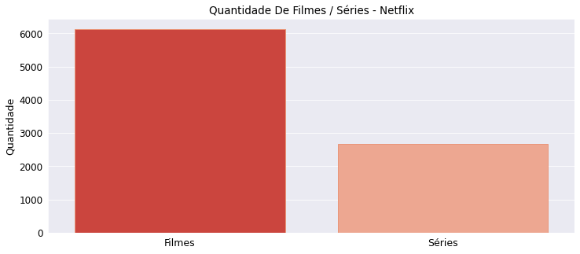

No entanto, para melhorar a expressabilidade de tal informação, plotamos um gráfico de pizza para vermos percentualmente a proporção da quantidade de filmes em comparação a quantidade de series presentes na Netflix:

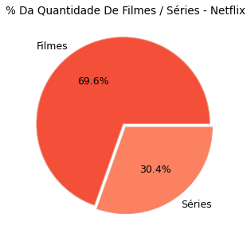

Disparadamente, há mais filmes disponíveis na Netflix em comparação à quantidade de séries, a diferença na quantidade de filmes e séries é gritante em que o registro de filmes disponíveis percentualmente é de 70 % comparativamente à de séries que é de 30 %.

Após respondermos tal questão simples, poderemos partir para uma questão relativa à produção de filmes e séries, isto é, quais países que se destacam mais na produção de filmes com base nas informações dadas pela Netflix?

#### **(2)** Quais países são destacáveis na produção de filmes e séries na Netflix?

Fizemos basicamente um agrupamento de países, para sabermos quais países que produzem e disponibilizam filmes na Netflix, e à partir disto contabilizamos a quantidade de filmes / séries de cada país:

| index | país           | qtd  |
|-------|----------------|------|
| 603   | United States  | 2818 |
| 251   | India          | 972  |
| 506   | United Kingdom | 419  |
| 319   | Japan          | 245  |
| 435   | South Korea    | 199  |
| 58    | Canada         | 181  |
| 444   | Spain          | 145  |
| 162   | France         | 124  |
| 342   | Mexico         | 110  |
| 150   | Egypt          | 106  |
|       |                |      |

A tabela acima representa os 10 países que mais se destacam somaticamente na produção de filmes e séries, também separamos duas tabelas para representar separadamente os 10 países que mais se destacam na produção de filmes ou séries:

Primeiramente, filtramos somente séries para sabermos quais são os 10 países que mais produzem e disponibilizam séries para a Netflix:

| index | países         | qtd |
|-------|----------------|-----|
| 160   | United States  | 760 |
| 140   | United Kingdom | 213 |
| 83    | Japan          | 169 |
| 120   | South Korea    | 158 |
| 66    | India          | 79  |
| 132   | Taiwan         | 68  |
| 17    | Canada         | 59  |
| 47    | France         | 49  |
| 4     | Australia      | 48  |
| 125   | Spain          | 48  |
|       |                |     |

Segundamente, filtramos somente filmes para sabermos quais são os 10 países que mais produzem e disponibilizam filmes para a Netflix:

| index | países         | qtd  |
|-------|----------------|------|
| 525   | United States  | 2058 |
| 218   | India          | 893  |
| 440   | United Kingdom | 206  |
| 50    | Canada         | 122  |
| 384   | Spain          | 97   |
| 128   | Egypt          | 92   |
| 319   | Nigeria        | 86   |
| 238   | Indonesia      | 77   |
| 428   | Turkey         | 76   |
| 278   | Japan          | 76   |
|       |                |      |

As tabelas trouxeram às informações esperadas, porém podemos plotar tais informações em gráficos de barras horizontais para representarmos mais intuitivamente tais informações ao nosso público.

Primeiramente, um gráfico relativo à quantidade somática de filmes e séries produzidas por país:

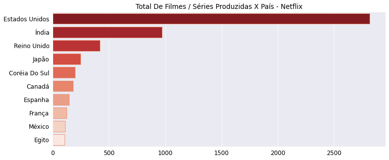

Segundamente, um gráfico relativo aos 10 países que mais se destacam na produção e disponibilização de séries para a Netflix:

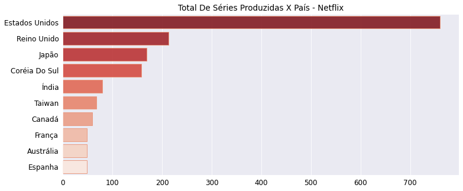

Por fim, um gráfico relativo aos 10 países que mais se destacam na produção e disponibilização de filmes para a Netflix:

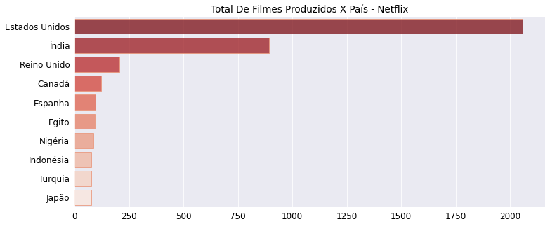

Em suma, como expectante, o Estados Unidos é o país mais destacável na produção de filmes e séries, abaixo há países como o Reino Unido, Córeia do Sul, Índia e Japão como países destacáveis na produção de filmes ou séries disponibilizados na Netflix.

###### Obs :. Não é afirmado que tais países são os países que mais produzem séries e filmes em relação ao mundo todo, o que é informado é que os 10 países exibidos nos gráficos acima são os que mais se destacam na produção e disponibilização de filmes / séries para a Netflix.

Respondida à nossa questão, poderemos continuar a explorar tais questões técnicas em relação ao que está disponibilizado na Netflix, por exemplo, podemos saber quais são os diretores de filmes com mais produções catalogadas disponivelmente na Netflix:

#### **(3)** Quais são os diretores que mais se destacam na produção e disponibilização de filmes para a Netflix?

Para respondermos diretamente tal questão, fizemos um processo de agrupamento análogo ao que foi feito para responder às questões anteriores, então rapidamente podemos plotar um gráfico de barras horizontais para sabermos quais diretores são mais destacáveis em relação à produção de filmes na Netflix:


Basicamente, o diretor com mais filmes dirigidos e disponibilizados para a Netflix é o diretor Rajiv Chilaka, reconhecido principalmente como um diretor de filmes de animação. 

Os diretores mais populares inclusos nessa lista são Martin Scorsese, diretor de filmes famigerados como O Lobo De Wall Street e Táxi Driver, semelhantemente há o diretor altamente reconhecido Steven Spielberg, diretor de filmes como A Lista De Schindler e De Volta Para O Futuro.

E como tais questões respondidas são relacionadas à plataforma de streaming Netflix, podemos trazer uma questão em relação à sua história, isto é, basicamente a Netflix é uma empresa que foi fundada em 1997, e que começou a trabalhar com serviços de streaming estimadamente em 2008, então desde 2008 até hoje, vários filmes e séries foram adicionados à plataforma.

Disto poderemos responder:

#### **(4)** Quantos filmes e séries foram adicionados à plataforma de streaming há cada ano?

Um gráfico de colunas será suficiente para expressar visualmente a quantidade de filmes / séries que foram adicionadas à plataforma de 2008 até 2021:

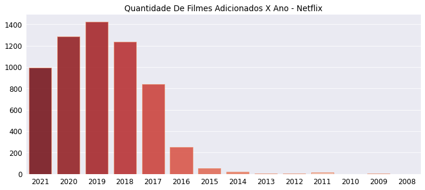

O gráfico acima representa a quantidade de filmes que foram adicionados à plataforma de 2008 até 2021.

Abaixo, teremos um gráfico para representar a quantidade de séries adicionadas à plataforma desde 2008 até 2021:

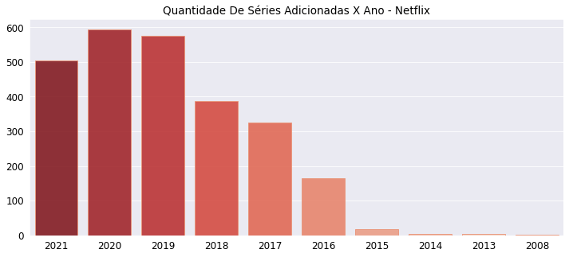

Basicamente, 2019 foi o ano que teve mais filmes adicionados a plataforma da Netflix, abaixo de 2019, 2020 foi o ano com mais filmes adicionáveis à plataforma.

Em relação à séries, inversamente 2020 foi o ano com mais séries adicionadas à plataforma e 2019 foi o segundo ano classificamente com mais séries aditivas à Netflix. 

Há como observarmos e supormos que no início a plataforma teve dificuldade para adicionar novos filmes ou séries por não terem tanto lucro para reinvestir largamente em mais filmes e séries para adicionar à plataforma. Conforme o sucesso mercadológico foi obtido pela empresa, mais filmes e séries foram facilmente disponibilizados e permissivos na plataforma.

Respondida está questão, poderemos tratar de questões estatísticas em relação aos filmes e séries disponibilizadas na Netflix, por exemplo:

#### **(5)** Qual é a média da duração dos filmes na Netflix?

Em minutos, descobrimos após eliminarmos os outliers (filmes com durações exorbitantes) que em média os filmes disponibilizados na Netflix tendem à durar em média de 90 à 100 minutos, isto é, os filmes na plataforma tendem à ter uma duração de 1 hora e 30 minutos aproximamente.

Para expor tal informação distributiva em relação a duração temporal dos filmes disponíveis na Netflix, plotamos um gráfico de violino e um gráfico de caixa (Box-Plot) para termos uma representação visual de tal informação:

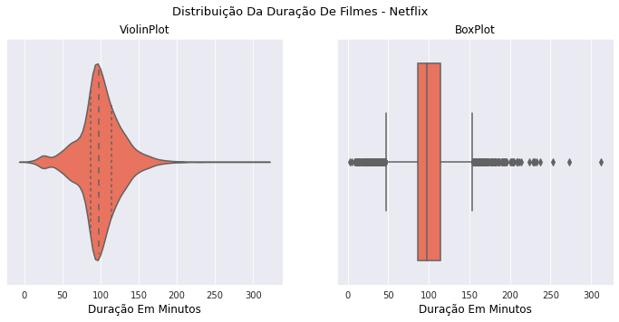

À partir de tal questão, poderemos continuar à responder perguntas relacionadas à esse tópico de duração de filmes (ou séries) para sabermos quais são os filmes e séries com o maior tempo de duração disponibilizados na Netflix?

#### **(6)** Quais são os filmes e séries com o maior tempo de duração que estão disponíveis na Netflix?

Basicamente, filtramos os dez filmes com o maior tempo de duração em minutos, e separadamente filtramos às dez séries com o maior tempo de duração em relação à quantidade de temporadas.

Disto, plotamos dois gráficos de barras horizontais para representar os dez filmes e séries com o maior tempo de duração:

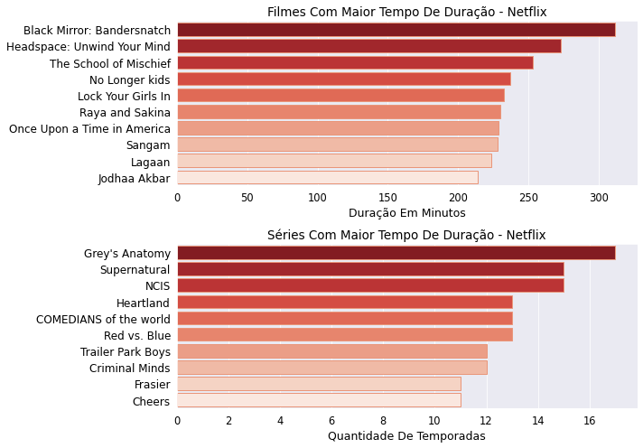

Basicamente, o filme Black Mirror Bandersnatch original da Netflix é o filme com o maior tempo de duração em minutos catalogado na plataforma, tal filme curiosamente é uma produção inovadora e insólita  por utilizar o expectador como um participante do filme que decidirá o destino roteirístico do protagonista (tal filme trata conceitualmente sobre a ilusão do livre-arbítrio de uma perspectiva filosófica).

As séries com maior tempo de duração em temporadas catalogados na Netflix são Grey's Anatomy e Supernatural que são séries com mais de 10 temporadas produzidas.

Para finalizar tal análise exploratória, podemos trazer informações relacionados à quantidade de filmes e séries por categoria, isto é, traremos respostas para a seguinte questão:

#### **(7)** Qual é a quantidade de filmes e séries por categoria (ou gênero)?

Basicamente, fizemos uma limpeza nos dados da coluna listado_em para separarmos os gêneros de cada filme e série para contabilizarmos individualmente a quantidade de filmes ou séries concernentes à cada categoria, disto plotamos dois gráficos de barras horizontais para representar os tipos e genêros de filmes e séries mais disponibilizados na plataforma.

Primeiramente, o gráfico abaixo representa a quantidade de filmes por gênero que estão disponíveis na Netflix:

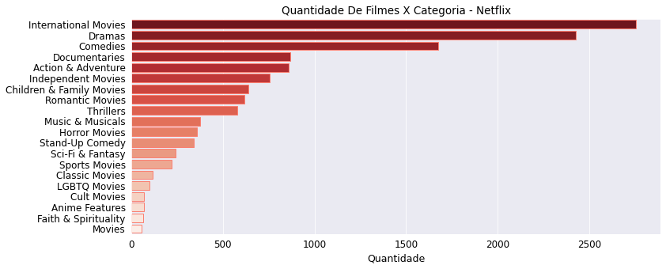

O gráfico seguinte expressa a quantidade de séries por gênero que estão disponibilizadas na Netflix:

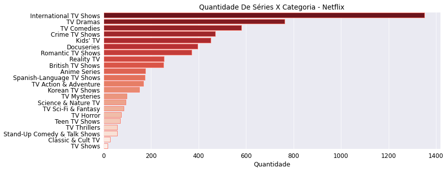

Em suma, concluímos que na Netflix, os gêneros de filmes que mais se destacam na plataforma são filmes internacionais, filmes de comédia, drama e especialmente documentários que são considerados tipologicamente como filmes.

Já os tipos de séries mais destacáveis na Netflix são séries internacionais, séries de drama, de comédia e especialmente séries criminais.

Curiosamente, os tipos de filmes mais catalogados são quase os mesmos tipos de séries catalogadas na Netflix.

Por fim, essa foi a análise exploratória relacionada aos dados da Netflix, espero que tais conhecimentos descobertos e expostos detalhadamente tenham sido proveitosos para explicitar mais informações sobre está plataforma que é tão popular e tão aclamada nos últimos anos no que concerne aos serviços de streaming.

## ANÁLISE EXPLORATÓRIA FINALIZADA
